# Database Integrity & State Machine Architecture
## Comprehensive Flowcharts and Improvement Plan

---

## Document Purpose

This document provides:
- Visual flowcharts of the game state machine
- Database entity relationships
- Current gaps and proposed improvements
- Realtime data flow architecture
- Implementation plan for Phase 1-3 improvements

---

## Table of Contents

1. [Game State Machine](#1-game-state-machine)
2. [Database Entity Relationships](#2-database-entity-relationships)
3. [Realtime Data Flow](#3-realtime-data-flow)
4. [Current Architecture Gaps](#4-current-architecture-gaps)
5. [Proposed Improvements](#5-proposed-improvements)
6. [Implementation Phases](#6-implementation-phases)

---

## 1. Game State Machine

### 1.1 Current Game States

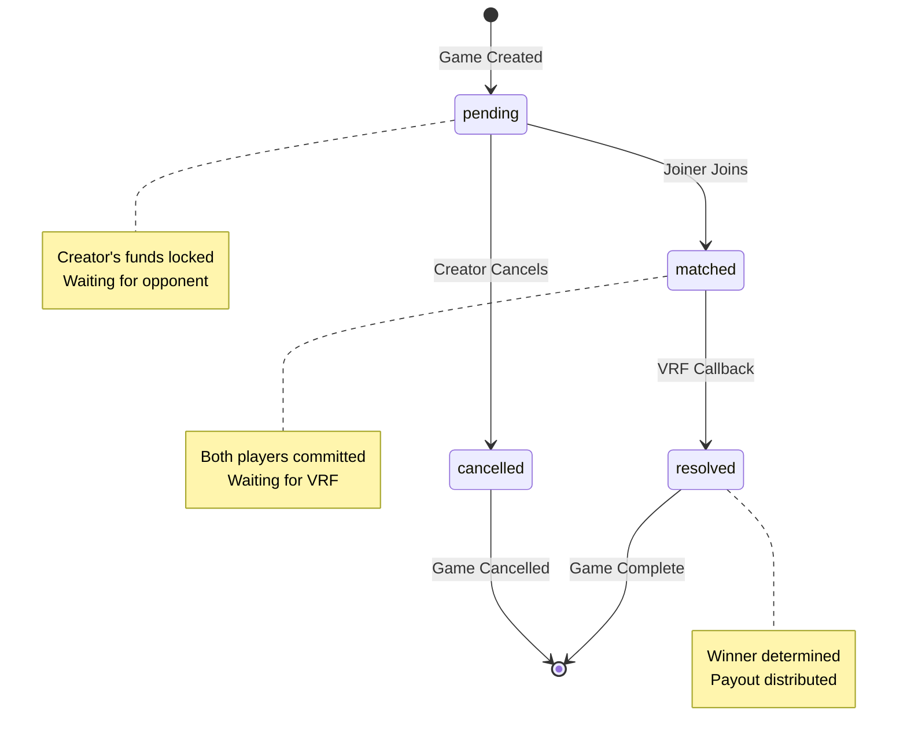

### 1.2 State Transition Rules

| From State | To State | Trigger | Required Fields | Validation |
|------------|----------|---------|-----------------|------------|
| (new) | pending | GameCreated event | creator_address, tier, amount, creator_choice | - |
| pending | matched | GameJoined event | joiner_address | joiner != creator |
| pending | cancelled | GameCancelled event | - | Only creator can cancel |
| matched | resolved | RandomnessReceived event | winner_address, coin_result, payout | Valid payout calc |

### 1.3 CRITICAL: Invalid Transitions (Currently NOT Enforced)

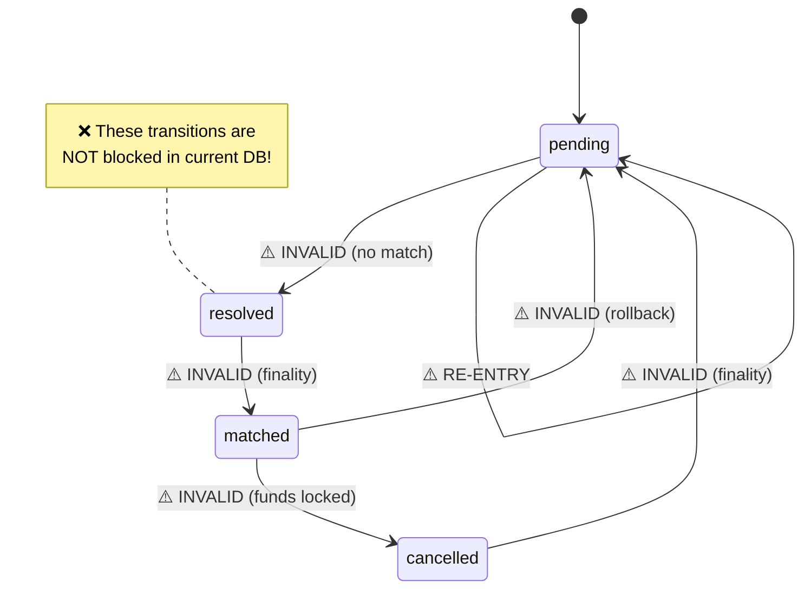

---

## 2. Database Entity Relationships

### 2.1 Core Tables ERD

```mermaid
erDiagram
    GAMES ||--o{ ACTIVITY_FEED : generates
    GAMES }|--|| TIERS : belongs_to
    USERS ||--o{ GAMES : creates_as_creator
    USERS ||--o{ GAMES : joins_as_joiner
    USERS ||--o{ USER_PREFERENCES : has
    USERS ||--o{ USER_STATS : aggregated_to
    INDEXER_STATE ||--o{ GAMES : tracks

    GAMES {
        bigint id PK
        bigint onchain_id UK
        text status
        int tier FK
        text creator_address FK
        text joiner_address FK
        text winner_address FK
        text amount
        text payout
        boolean creator_choice
        boolean coin_result
        timestamptz created_at
        timestamptz matched_at
        timestamptz resolved_at
    }

    USERS {
        text wallet_address PK
        text ens_name
        timestamptz created_at
        timestamptz last_seen
    }

    USER_PREFERENCES {
        text user_address PK_FK
        boolean skip_animation
        boolean sound_enabled
        boolean active_games_collapsed
        boolean activity_feed_collapsed
        int default_tier
        boolean default_choice
    }

    USER_STATS {
        text wallet_address PK
        int total_games
        int wins
        int losses
        numeric win_rate
        text net_profit
    }

    ACTIVITY_FEED {
        bigint id PK
        text event_type
        bigint game_id FK
        text player_address
        int tier
        text amount
        text payout
        timestamptz created_at
    }

    TIERS {
        int id PK
        text amount
        text label
        boolean enabled
    }

    INDEXER_STATE {
        text indexer_name PK
        bigint last_processed_block
        timestamptz updated_at
    }
```

### 2.2 Views Dependency Graph

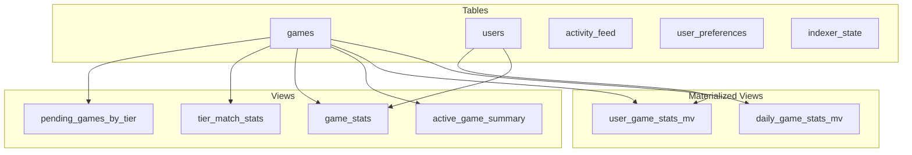

---

## 3. Realtime Data Flow

### 3.1 Event Processing Pipeline

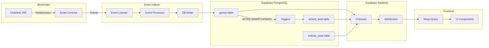

### 3.2 Realtime Subscription Channels

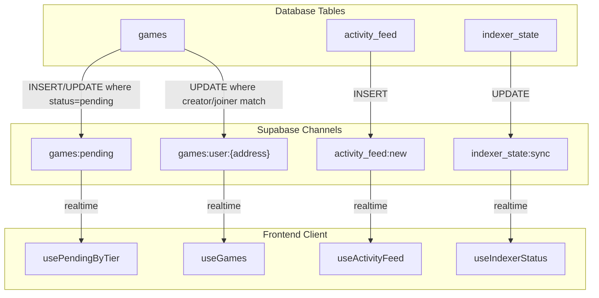

### 3.3 Activity Feed Auto-Population

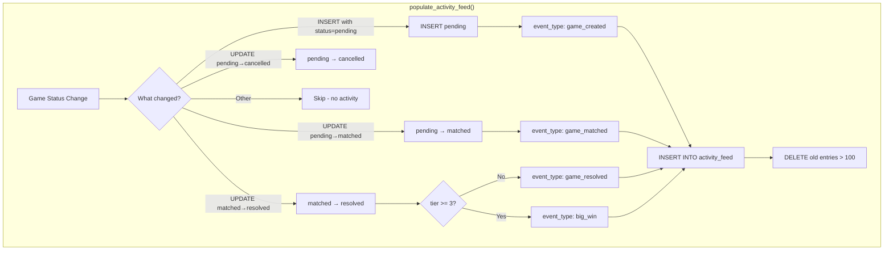

---

## 4. Current Architecture Gaps

### 4.1 Security Issues Matrix

```mermaid
mindmap
  root((Security Gaps))
    State Machine
      No transition validation
      Can skip matched state
      Can update resolved games
    RLS Policies
      USING(true) = public read
      Opponents can see choices
      No address verification
    Data Validation
      Address format unchecked
      Payout math unverified
      Tier bounds unchecked
    Field Constraints
      joiner_address nullable when matched
      winner_address nullable when resolved
      coin_result nullable when resolved
```

### 4.2 Risk Assessment

| Gap | Risk Level | Impact | Exploitability |
|-----|------------|--------|----------------|
| No state machine enforcement | 🔴 Critical | Data corruption | Moderate |
| RLS allows choice snooping | 🟠 High | Game fairness | Easy |
| Missing field constraints | 🟡 Medium | Data integrity | Low |
| No address validation | 🟡 Medium | Data quality | Low |
| Payout validation missing | 🟠 High | Financial | Moderate |

---

## 5. Proposed Improvements

### 5.1 State Machine Enforcement

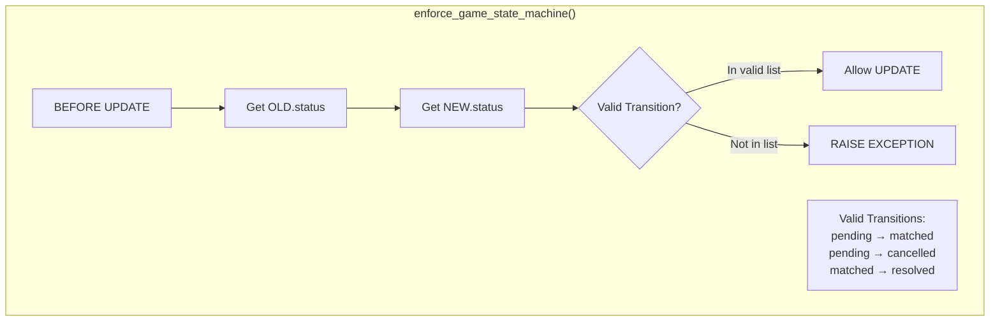

### 5.2 Enhanced RLS Policies

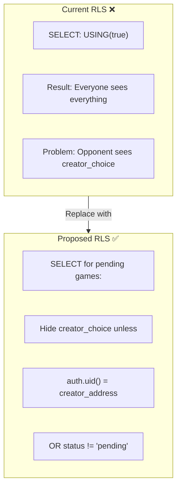

### 5.3 Field Constraint Enforcement

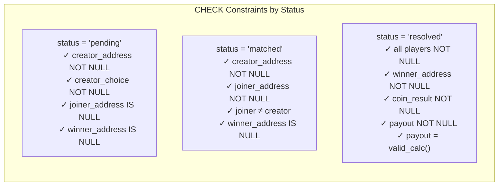

---

## 6. Implementation Phases

### 6.1 Phase Overview

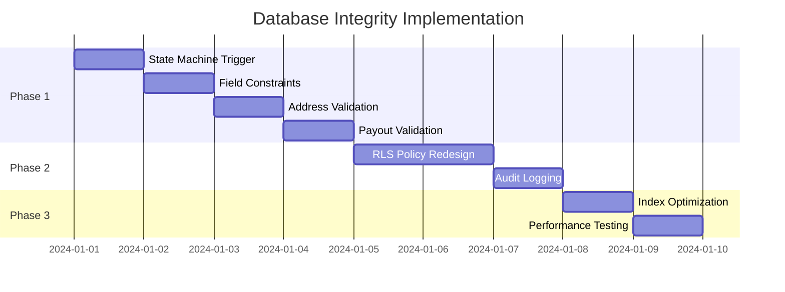

### 6.2 Phase 1: Core Integrity (Priority: Critical)

```sql
-- 1. State Machine Enforcement Trigger
CREATE OR REPLACE FUNCTION enforce_game_state_machine()
RETURNS TRIGGER AS $$
DECLARE
  valid_transitions TEXT[][] := ARRAY[
    ['pending', 'matched'],
    ['pending', 'cancelled'],
    ['matched', 'resolved']
  ];
  transition_valid BOOLEAN := FALSE;
BEGIN
  -- Check if transition is valid
  FOR i IN 1..array_length(valid_transitions, 1) LOOP
    IF OLD.status = valid_transitions[i][1]
       AND NEW.status = valid_transitions[i][2] THEN
      transition_valid := TRUE;
      EXIT;
    END IF;
  END LOOP;

  -- Same status is always valid (field updates)
  IF OLD.status = NEW.status THEN
    transition_valid := TRUE;
  END IF;

  IF NOT transition_valid THEN
    RAISE EXCEPTION 'Invalid state transition: % → %',
      OLD.status, NEW.status;
  END IF;

  RETURN NEW;
END;
$$ LANGUAGE plpgsql;

-- 2. Field Constraints by Status
ALTER TABLE games ADD CONSTRAINT valid_pending_fields CHECK (
  status != 'pending' OR (
    creator_address IS NOT NULL AND
    creator_choice IS NOT NULL AND
    joiner_address IS NULL AND
    winner_address IS NULL
  )
);

ALTER TABLE games ADD CONSTRAINT valid_matched_fields CHECK (
  status != 'matched' OR (
    creator_address IS NOT NULL AND
    joiner_address IS NOT NULL AND
    creator_address != joiner_address AND
    winner_address IS NULL
  )
);

ALTER TABLE games ADD CONSTRAINT valid_resolved_fields CHECK (
  status != 'resolved' OR (
    creator_address IS NOT NULL AND
    joiner_address IS NOT NULL AND
    winner_address IS NOT NULL AND
    coin_result IS NOT NULL AND
    payout IS NOT NULL
  )
);

-- 3. Ethereum Address Validation
CREATE OR REPLACE FUNCTION is_valid_eth_address(addr TEXT)
RETURNS BOOLEAN AS $$
BEGIN
  RETURN addr ~* '^0x[a-f0-9]{40}$';
END;
$$ LANGUAGE plpgsql IMMUTABLE;

ALTER TABLE games ADD CONSTRAINT valid_creator_address
  CHECK (is_valid_eth_address(creator_address));
ALTER TABLE games ADD CONSTRAINT valid_joiner_address
  CHECK (joiner_address IS NULL OR is_valid_eth_address(joiner_address));
ALTER TABLE games ADD CONSTRAINT valid_winner_address
  CHECK (winner_address IS NULL OR is_valid_eth_address(winner_address));
```

### 6.3 Phase 2: Access Control (Priority: High)

```sql
-- Fixed RLS: Hide creator_choice in pending games
DROP POLICY IF EXISTS "Games are publicly readable" ON games;

CREATE POLICY "Games readable with choice protection"
  ON games FOR SELECT
  USING (
    status != 'pending' OR
    auth.uid()::text = creator_address OR
    (SELECT current_setting('request.jwt.claims', true)::json->>'role') = 'service_role'
  );

-- Create view that hides choice for non-creators
CREATE OR REPLACE VIEW games_safe AS
SELECT
  id, onchain_id, status, tier, amount, payout,
  creator_address, joiner_address, winner_address,
  CASE
    WHEN status = 'pending' AND auth.uid()::text != creator_address
    THEN NULL
    ELSE creator_choice
  END as creator_choice,
  coin_result,
  created_at, matched_at, resolved_at
FROM games;

-- Audit logging table
CREATE TABLE game_state_audit (
  id BIGSERIAL PRIMARY KEY,
  game_id BIGINT NOT NULL,
  old_status TEXT,
  new_status TEXT,
  changed_by TEXT,
  changed_at TIMESTAMPTZ DEFAULT NOW(),
  details JSONB
);

CREATE OR REPLACE FUNCTION log_game_state_change()
RETURNS TRIGGER AS $$
BEGIN
  INSERT INTO game_state_audit (game_id, old_status, new_status, changed_by, details)
  VALUES (
    NEW.id,
    OLD.status,
    NEW.status,
    current_user,
    jsonb_build_object(
      'old', row_to_json(OLD),
      'new', row_to_json(NEW)
    )
  );
  RETURN NEW;
END;
$$ LANGUAGE plpgsql;
```

### 6.4 Phase 3: Performance (Priority: Medium)

```sql
-- Optimized compound indexes
CREATE INDEX CONCURRENTLY IF NOT EXISTS idx_games_status_tier
  ON games(status, tier) WHERE status IN ('pending', 'matched');

CREATE INDEX CONCURRENTLY IF NOT EXISTS idx_games_user_lookup
  ON games(creator_address, joiner_address, created_at DESC);

CREATE INDEX CONCURRENTLY IF NOT EXISTS idx_activity_feed_recent
  ON activity_feed(created_at DESC) WHERE created_at > NOW() - INTERVAL '1 hour';

-- Partial index for active games only
CREATE INDEX CONCURRENTLY IF NOT EXISTS idx_games_active
  ON games(id, tier, creator_address, created_at)
  WHERE status IN ('pending', 'matched');
```

---

## 7. Data Flow Summary

### 7.1 Complete System Flow

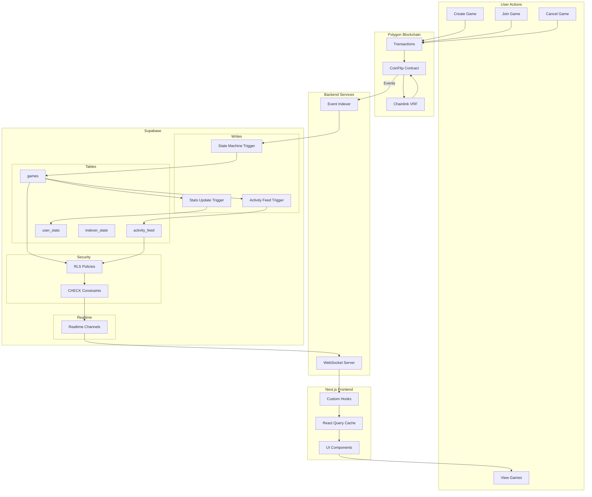

---

## 8. Migration Checklist

### Phase 1 Migration

- [ ] Create `enforce_game_state_machine()` trigger function
- [ ] Create trigger on games table BEFORE UPDATE
- [ ] Add CHECK constraint for pending fields
- [ ] Add CHECK constraint for matched fields
- [ ] Add CHECK constraint for resolved fields
- [ ] Create `is_valid_eth_address()` function
- [ ] Add address validation constraints
- [ ] Create payout validation function
- [ ] Test all constraints with edge cases

### Phase 2 Migration

- [ ] Drop existing RLS policies
- [ ] Create new RLS with choice protection
- [ ] Create `games_safe` view
- [ ] Create `game_state_audit` table
- [ ] Create audit trigger
- [ ] Test RLS with different user contexts

### Phase 3 Migration

- [ ] Analyze current query patterns
- [ ] Create optimized indexes
- [ ] Run EXPLAIN ANALYZE on critical queries
- [ ] Set up pg_stat_statements monitoring
- [ ] Performance benchmark before/after

---

## Appendix: SQL Migration File

See `supabase/migrations/028_database_integrity_enforcement.sql` for the complete implementation.
