# CoinFlip System Architecture

## Overview

This document provides a comprehensive view of the CoinFlip application architecture.

---

## High-Level Architecture

```mermaid
flowchart TB
    subgraph Client["🌐 CLIENT (Browser)"]
        subgraph Pages["Pages (app/)"]
            P1["/page.tsx<br/>Home/Play"]
            P2["/queue/page.tsx<br/>Game Queue"]
            P3["/history/page.tsx"]
            P4["/leaderboard/page.tsx"]
            P5["/stats/page.tsx"]
            P6["/settings/page.tsx"]
            P7["/dashboard/page.tsx"]
        end

        subgraph Components["Components"]
            C1["GameSessionModal"]
            C2["TierSelector"]
            C3["ActiveGamesPanel"]
            C4["ActivityFeed"]
            C5["Header/Layout"]
            C6["WalletButton"]
        end

        subgraph Providers["Providers (components/Providers.tsx)"]
            PR1["QueryClientProvider"]
            PR2["WagmiProvider"]
            PR3["ThemeProvider"]
            PR4["DataProvider"]
            PR5["GlobalErrorHandler"]
        end
    end

    subgraph Hooks["🪝 HOOKS LAYER"]
        H1["useGames<br/>usePlayerGames<br/>useActiveGames"]
        H2["useRealtimeStats<br/>usePendingByTier<br/>useActivityFeed"]
        H3["useContract<br/>useCreatedGameTracking"]
        H4["usePendingTransactions<br/>useGameLimits"]
        H5["useUserPreferences<br/>useNotificationState"]
        H6["useLeaderboard<br/>usePlayerRank"]
        H7["useRealtimeSync<br/>useGameSync"]
        H8["useAuth<br/>useSupabaseAuth"]
    end

    subgraph DataLayer["📊 DATA LAYER"]
        DL1["lib/queries/*<br/>Centralized Queries"]
        DL2["lib/validation/*<br/>Zod Schemas"]
        DL3["lib/realtime/*<br/>Subscription Registry"]
        DL4["lib/data/*<br/>Data Sources"]
    end

    subgraph State["🗄️ STATE"]
        ST1["React Query Cache"]
        ST2["Zustand Stores<br/>gameStore, uiStore"]
        ST3["Local Storage<br/>Preferences"]
    end

    subgraph External["🔗 EXTERNAL"]
        EX1["Supabase<br/>Database + Realtime"]
        EX2["Ethereum<br/>Sepolia Testnet"]
        EX3["Chainlink VRF<br/>Randomness"]
    end

    Pages --> Components
    Components --> Hooks
    Hooks --> DataLayer
    DataLayer --> State
    DataLayer --> External
    Providers --> Pages
```

---

## Detailed Layer Architecture

### 1. Types Layer (Single Source of Truth)

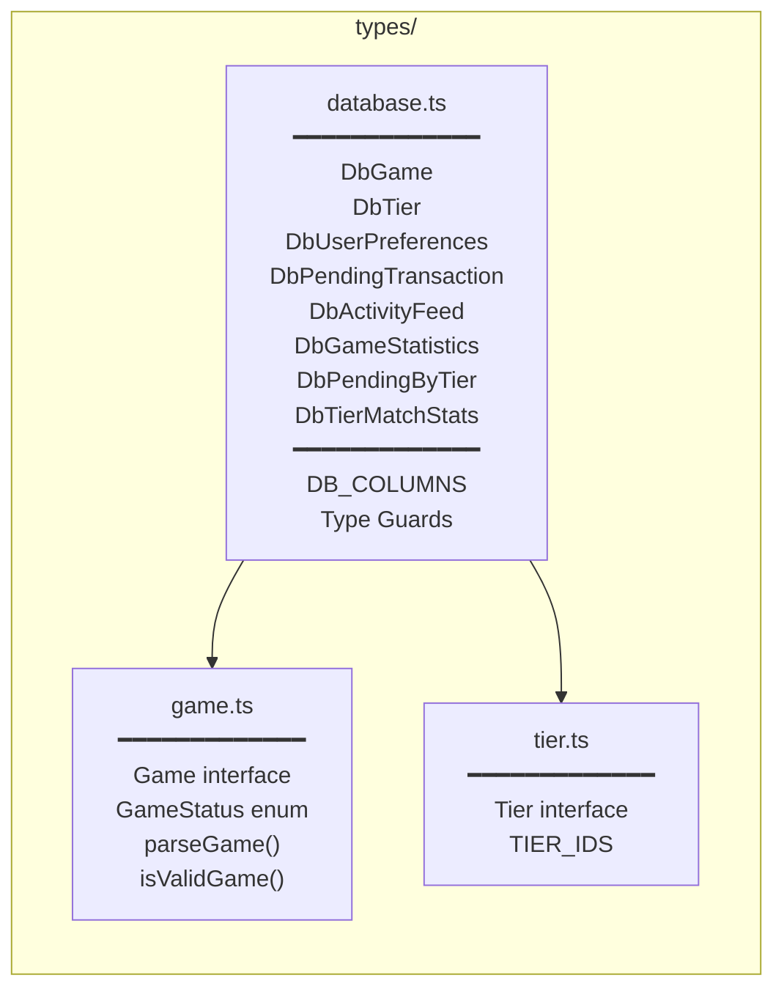

### 2. Queries Layer (Centralized)

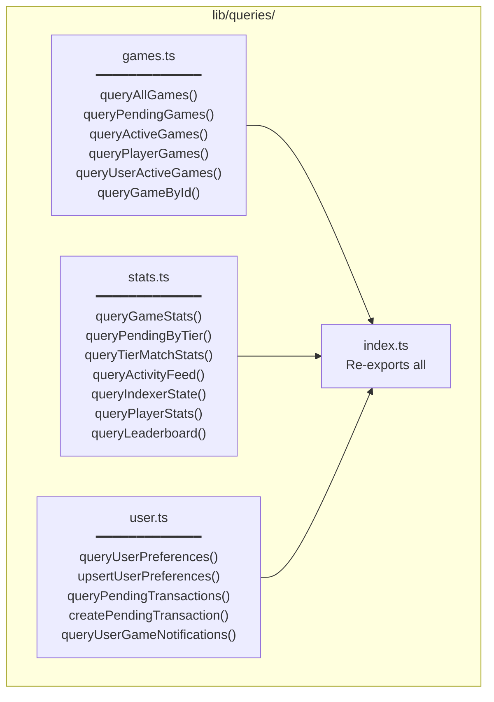

### 3. Validation Layer

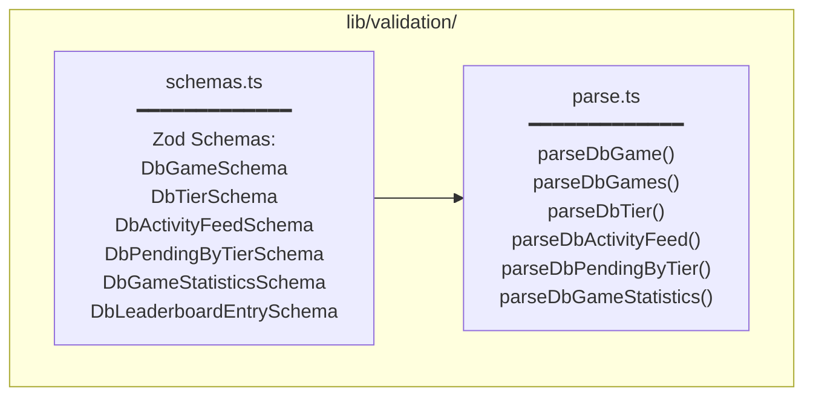

### 4. Realtime Layer

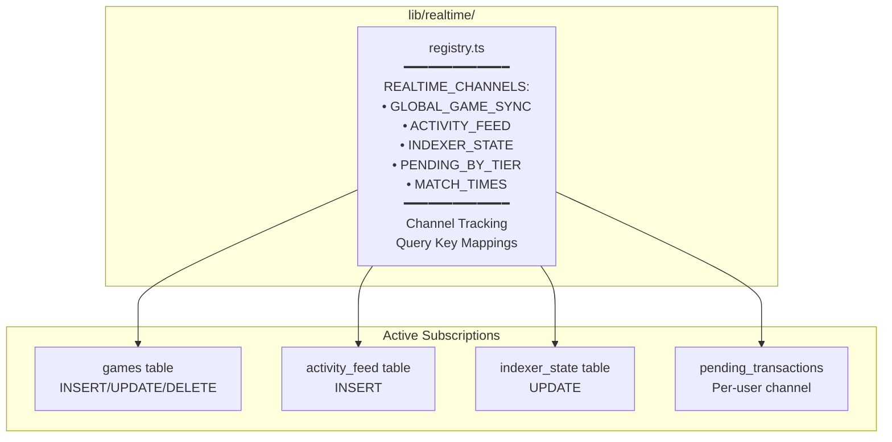

---

## Hooks Architecture

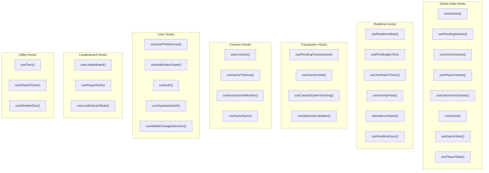

---

## Data Flow Diagram

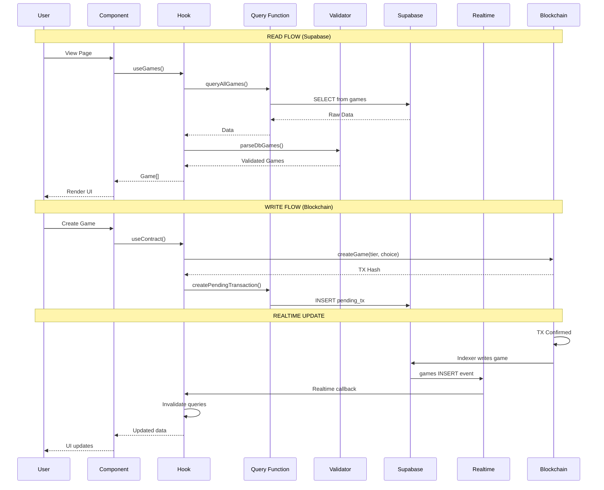

---

## Component Hierarchy

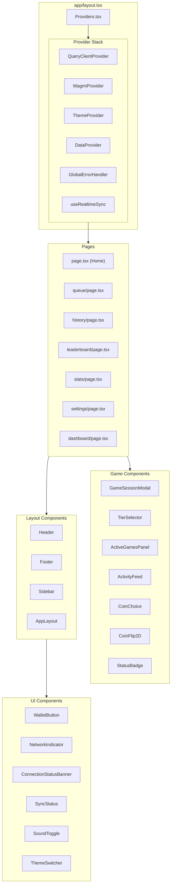

---

## State Management

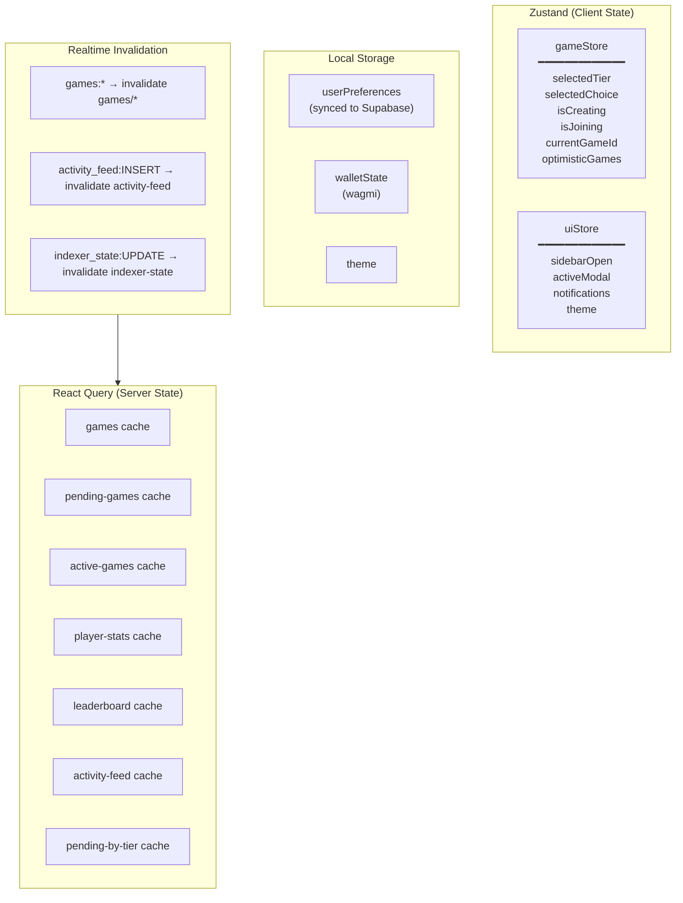

---

## External Services

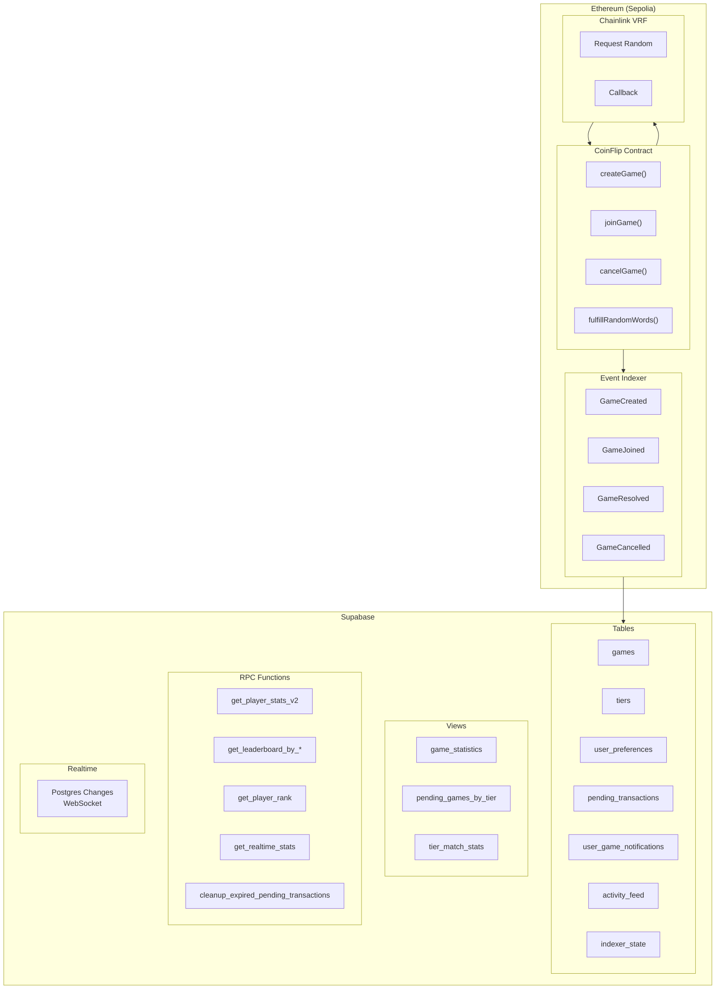

---

## File Structure Overview

```
coinflip/
├── app/                          # Next.js App Router
│   ├── layout.tsx               # Root layout with providers
│   ├── page.tsx                 # Home/Play page
│   ├── queue/page.tsx           # Game queue
│   ├── history/page.tsx         # Game history
│   ├── leaderboard/page.tsx     # Leaderboards
│   ├── stats/page.tsx           # Statistics
│   ├── settings/page.tsx        # User settings
│   ├── dashboard/page.tsx       # Dashboard
│   └── api/                     # API routes
│       ├── health/route.ts      # Health check
│       └── rpc/route.ts         # RPC endpoint
│
├── components/
│   ├── Providers.tsx            # All providers + error handler
│   ├── game/                    # Game-specific components
│   │   ├── GameSessionModal.tsx
│   │   ├── TierSelector.tsx
│   │   ├── ActiveGamesPanel.tsx
│   │   ├── ActivityFeed.tsx
│   │   ├── CoinChoice.tsx
│   │   └── CoinFlip2D.tsx
│   ├── layout/                  # Layout components
│   │   ├── Header.tsx
│   │   ├── Footer.tsx
│   │   └── AppLayout.tsx
│   └── ui/                      # Reusable UI components
│       ├── WalletButton.tsx
│       ├── NetworkIndicator.tsx
│       └── SyncStatus.tsx
│
├── hooks/                        # Custom React hooks
│   ├── useGames.ts              # Game data hooks
│   ├── useRealtimeStats.ts      # Realtime stats hooks
│   ├── useContract.ts           # Contract interactions
│   ├── usePendingTransactions.ts
│   ├── useUserPreferences.ts
│   ├── useLeaderboard.ts
│   ├── useRealtimeSync.tsx      # Central realtime sync
│   └── ...
│
├── lib/                          # Shared utilities
│   ├── supabase.ts              # Supabase client
│   ├── wagmi.ts                 # Wagmi config
│   ├── queries/                 # ✨ NEW: Centralized queries
│   │   ├── index.ts
│   │   ├── games.ts
│   │   ├── stats.ts
│   │   └── user.ts
│   ├── validation/              # ✨ NEW: Zod validation
│   │   ├── index.ts
│   │   ├── schemas.ts
│   │   └── parse.ts
│   ├── realtime/                # ✨ NEW: Realtime registry
│   │   ├── index.ts
│   │   └── registry.ts
│   ├── data/                    # Data layer abstraction
│   │   ├── blockchain.ts
│   │   ├── supabase-source.ts
│   │   ├── provider.tsx
│   │   └── types.ts
│   ├── contracts/               # Contract ABIs & addresses
│   ├── auth/                    # Auth utilities
│   ├── constants.ts
│   ├── queryKeys.ts
│   └── utils.ts
│
├── types/                        # ✨ ENHANCED: Type definitions
│   ├── database.ts              # Single source of truth
│   ├── game.ts
│   └── tier.ts
│
├── store/                        # Zustand stores
│   ├── gameStore.ts
│   └── uiStore.ts
│
├── scripts/                      # CLI scripts
│   ├── event-indexer.ts         # Blockchain indexer
│   ├── deploy.ts
│   └── ...
│
├── contracts/                    # Solidity contracts
│   └── CoinFlip.sol
│
├── tests/                        # Test files
│   ├── unit/
│   ├── contracts/
│   └── api/
│
└── docs/                         # Documentation
    └── architecture/
        └── SYSTEM_ARCHITECTURE.md  # This file
```

---

## Authentication Architecture

### Overview

CoinFlip uses **wallet-based authentication** without traditional username/password. The user's Ethereum wallet address serves as their identity.

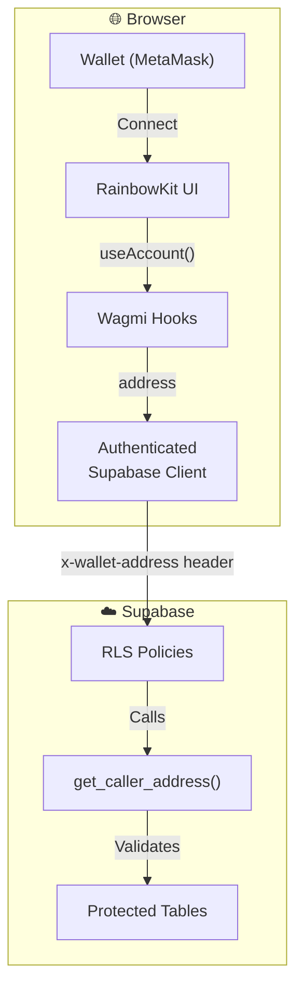

### Authentication Flow

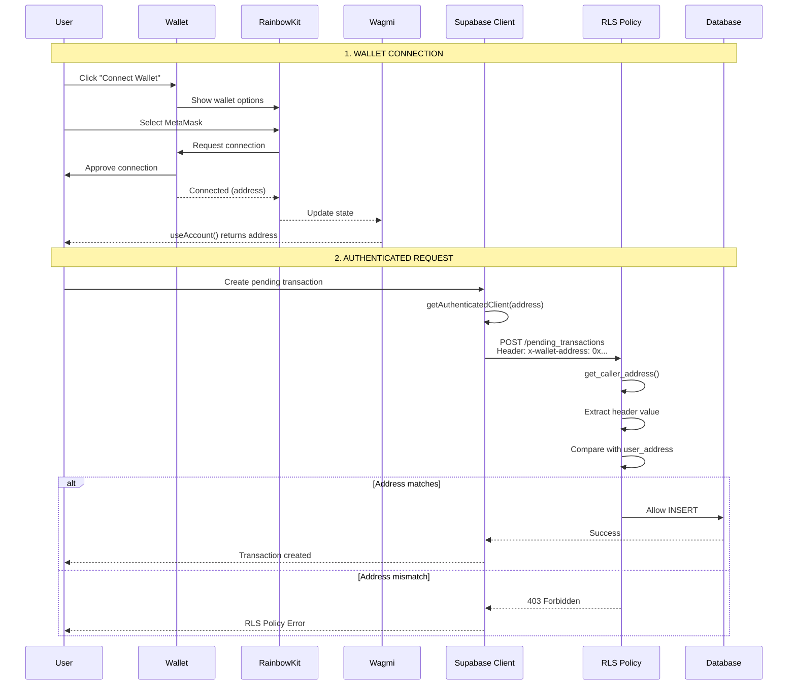

### Key Components

#### 1. Wallet Connection (Client-Side)

```typescript
// lib/wagmi.ts - Wagmi configuration
import { createConfig, http } from 'wagmi';
import { sepolia } from 'wagmi/chains';

export const config = createConfig({
  chains: [sepolia],
  transports: {
    [sepolia.id]: http(),
  },
});

// components/ui/WalletButton.tsx
import { ConnectButton } from '@rainbow-me/rainbowkit';
// RainbowKit provides the connect UI
```

#### 2. Authenticated Supabase Client

```typescript
// lib/supabase.ts

// Base client (NO wallet header - for public queries)
export const supabase = createClient(url, anonKey);

// Authenticated client (WITH wallet header - for RLS-protected queries)
export function getAuthenticatedClient(walletAddress: string): SupabaseClient {
  return createClient(url, anonKey, {
    global: {
      headers: {
        'x-wallet-address': walletAddress.toLowerCase(),
      },
    },
  });
}
```

#### 3. Using Authenticated Client in Hooks

```typescript
// hooks/usePendingTransactions.ts

export function usePendingTransactions() {
  const { address } = useAccount(); // From wagmi

  // Create authenticated client with wallet header
  const authClient = useMemo(() => {
    if (!address) return null;
    return getAuthenticatedClient(address);
  }, [address]);

  // Use authClient for all RLS-protected operations
  const createMutation = useMutation({
    mutationFn: async (input) => {
      const { data, error } = await authClient  // ✅ Uses authenticated client
        .from('pending_transactions')
        .insert({ user_address: address.toLowerCase(), ... })
        .select()
        .single();
    },
  });
}
```

#### 4. RLS Policy (Database-Side)

```sql
-- Migration 031: RLS Security

-- Helper function to extract wallet address from request
CREATE OR REPLACE FUNCTION get_caller_address()
RETURNS TEXT AS $$
DECLARE
  header_wallet TEXT;
BEGIN
  -- Extract x-wallet-address header
  header_wallet := current_setting('request.headers', true)::json->>'x-wallet-address';

  -- Validate it's a valid Ethereum address
  IF header_wallet IS NOT NULL AND header_wallet ~ '^0x[a-fA-F0-9]{40}$' THEN
    RETURN lower(header_wallet);
  END IF;

  RETURN NULL;
END;
$$ LANGUAGE plpgsql SECURITY DEFINER STABLE;

-- RLS Policy: Users can only access their own data
CREATE POLICY "pending_transactions_insert"
  ON pending_transactions FOR INSERT
  WITH CHECK (
    lower(user_address) = get_caller_address()
  );
```

### Protected vs Public Tables

| Table | RLS | Access Pattern |
|-------|-----|----------------|
| `games` | Public READ | Anyone can view games |
| `tiers` | Public READ | Anyone can view tiers |
| `activity_feed` | Public READ | Anyone can view activity |
| `pending_transactions` | **User-only** | Only owner can CRUD |
| `user_preferences` | **User-only** | Only owner can CRUD |
| `user_game_notifications` | **User-only** | Only owner can CRUD |

### Auth Flow by Feature

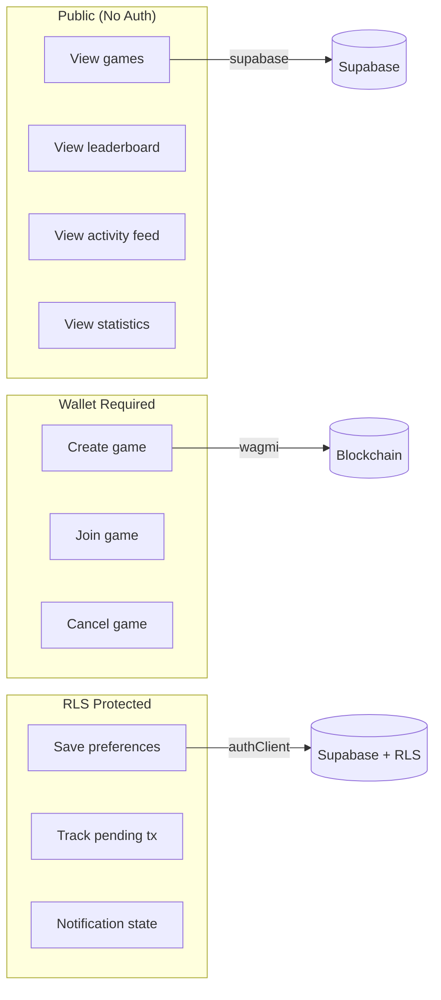

### Common Issues & Solutions

| Issue | Cause | Solution |
|-------|-------|----------|
| `403 Forbidden` on INSERT | Missing `x-wallet-address` header | Use `getAuthenticatedClient(address)` |
| `get_caller_address()` returns NULL | Invalid or missing header | Ensure address is lowercase, valid format |
| RLS blocks own data | Address case mismatch | Always use `.toLowerCase()` |
| Auth works in dev, fails in prod | Client not passing header | Check client instantiation |

### Security Considerations

1. **No Private Keys**: App never accesses wallet private keys
2. **Signature Verification**: For high-security ops, require signed messages
3. **Address Validation**: RLS validates address format (0x + 40 hex chars)
4. **Case Normalization**: All addresses stored/compared as lowercase
5. **Rate Limiting**: Client-side rate limits on game creation/joining

---

## Key Relationships

| Layer | Depends On | Used By |
|-------|-----------|---------|
| `types/database.ts` | - | Everything |
| `lib/queries/*` | `types/database.ts`, `lib/supabase.ts` | Hooks |
| `lib/validation/*` | `types/database.ts` | Hooks, Queries |
| `lib/realtime/*` | `lib/supabase.ts` | Hooks |
| `hooks/*` | Queries, Validation, Realtime | Components |
| `store/*` | - | Components, Hooks |
| `components/*` | Hooks, Store | Pages |
| `app/*` | Components | - |

---

## Data Flow Summary

1. **Types First**: All database types defined in `types/database.ts`
2. **Centralized Queries**: `lib/queries/*` contains all Supabase query functions
3. **Runtime Validation**: `lib/validation/*` validates data with Zod schemas
4. **Hooks Consume**: Hooks use queries and validation, return typed data
5. **Components Render**: Components call hooks, display data
6. **Realtime Updates**: Subscriptions invalidate React Query cache
7. **State Synced**: Zustand for UI state, React Query for server state
